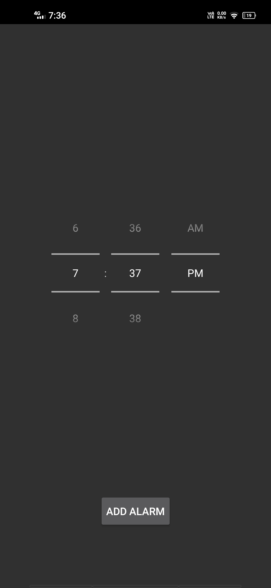
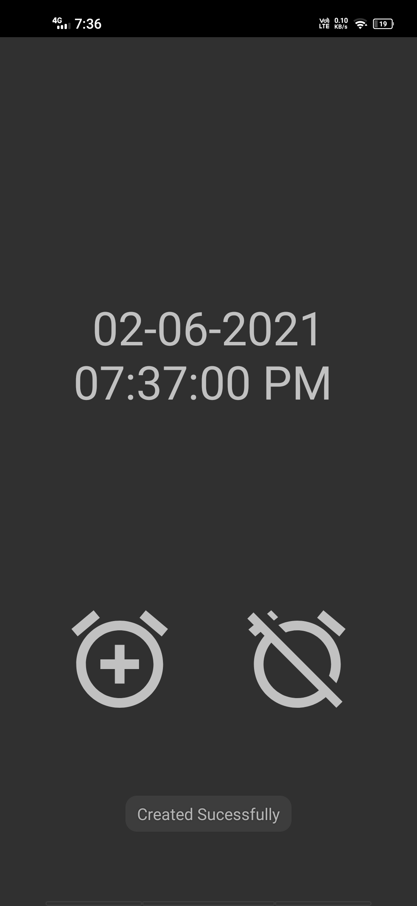
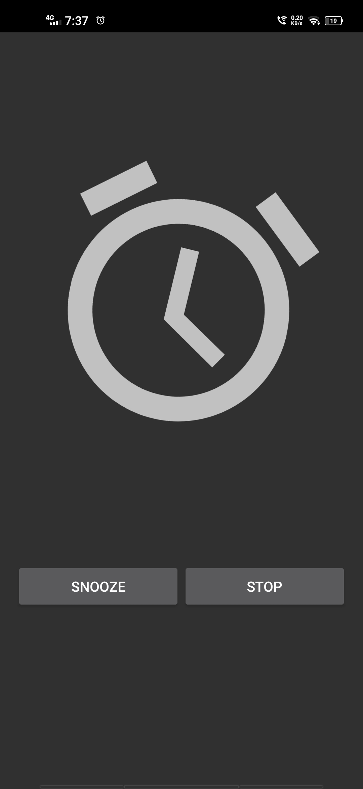

# Alarm-App
A simple alarm app which demonstrates the use of broadcast receiver and services in android. 

 

   &nbsp;     &nbsp;    

   &nbsp;     &nbsp;    

### Concepts Covered 

   * Broadcast Reciever and Services
   * Android Notification Manager 
   * Alarm Manager
   * Shared Prefernces
   * Media Player and Vibrator
   * DAO
   * Pending Intent
   * Object Animator
   
